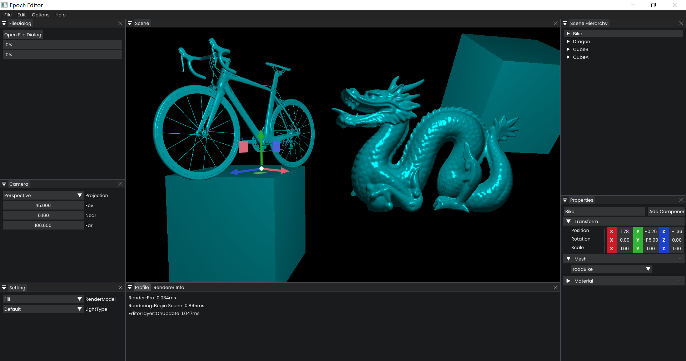
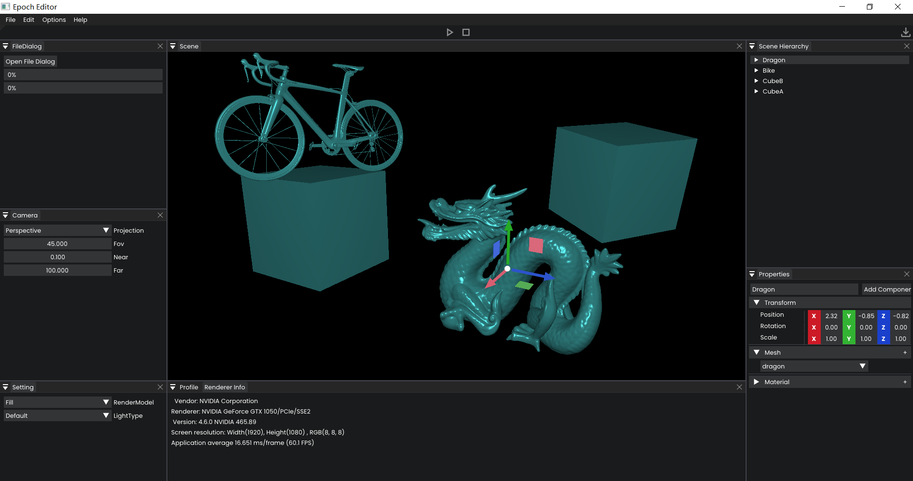
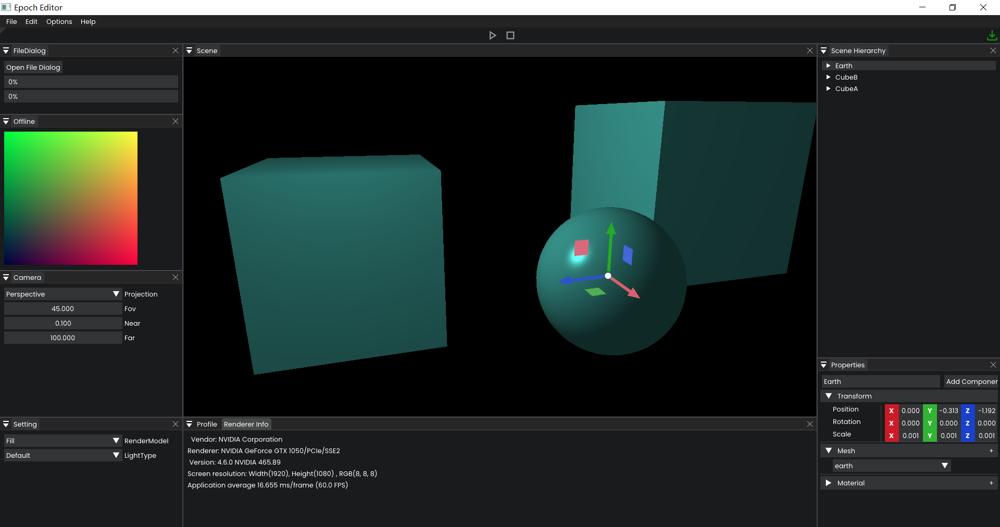
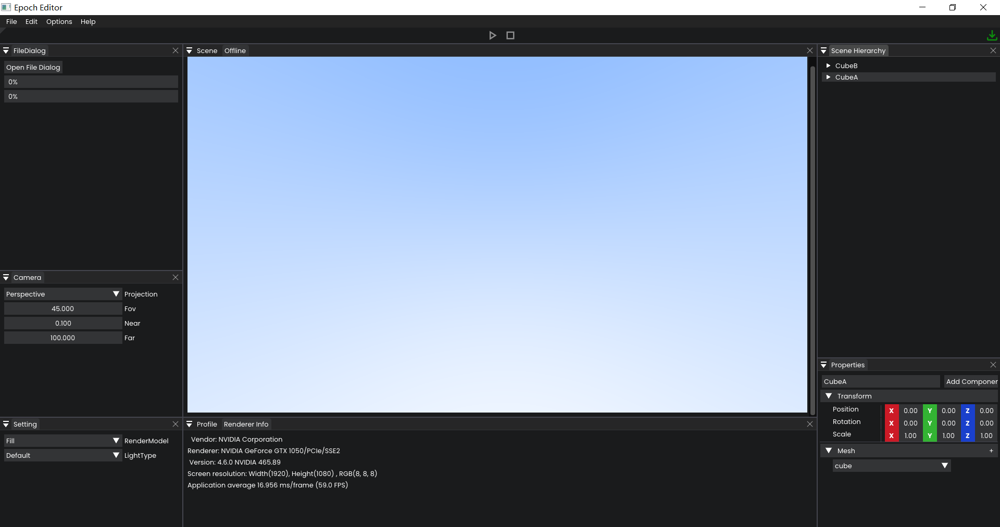

# Epoch Render Engine

 English | [简体中文](./README-CN.md)

Epoch is primarily an early-stage interactive application and rendering engine for Windows. Currently not much is implemented.

## New Feature Now
### v0.0.1-Alpha

### v0.0.2-Alpha

### v0.0.3-Alpha

### v0.0.4-Alpha
- Run-time Rendering
- Off-line Rendering
- Resource System(Mesh) -- plan -> Texture, Material ...
- Something else

## Getting Started

Visual Studio 2017 or 2019 is recommended, Epoch is officially untested on other development environments whilst we focus on a Windows build.

Start by cloning the repository with `git clone --recursive https://github.com/Acmen-Team/Epoch`.

If the repository was cloned non-recursively previously, use `git submodule update --init` to clone the necessary submodules.

### Main features to come:
- Fast 2D rendering (UI, particles, sprites, etc.)
- High-fidelity Physically-Based 3D rendering (this will be expanded later, 2D to come first)
- Support for Mac, Linux, Android and iOS
    - Native rendering API support (OpenGL, DirectX, Vulkan, Metal)
- Fully featured viewer and editor applications
- Fully scripted interaction and behavior
- Integrated 3rd party 2D and 3D physics engine
- Procedural terrain and world generation
