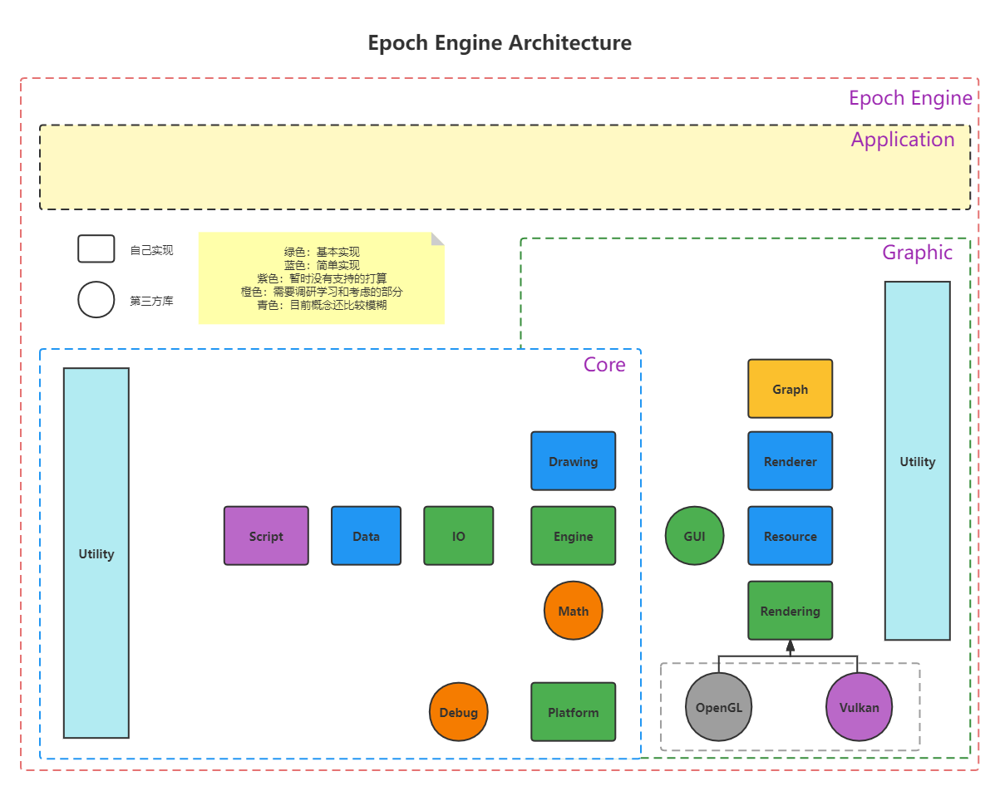

# Epoch Render Engine

 简体中文 | [English](./README-EN.md)

Epoch是一个专门关注于渲染的引擎，目前还没有实现太多，未来的想法是可以实现实时渲染与离线渲染的共同支持并支持以连续帧的形式从实时渲染转换到离线渲染。

## Epoch Engine Architecture

## 如何构建
目前支持VS2017和VS2019的脚本化构建（在仓库的Script文件夹里）

递归克隆仓库 `git clone --recursive https://github.com/Acmen-Team/Epoch`.

更新子模块 `git submodule update --init`.

### 开发计划
- 对于Light对象的封装与支持（难度1）
    + 支持点光源，平行光，聚光灯等多种光源类型
    + 遵循现有代码风格，做好注释，尽可能提高代码质量
    + 相关参考链接
        - https://learnopengl-cn.github.io/02%20Lighting/05%20Light%20casters/
        - https://www.techspot.com/article/1998-how-to-3d-rendering-lighting-shadows/
    + 对应讨论区大家各抒己见：https://github.com/Acmen-Team/Epoch/discussions/5
    + 对应projects：https://github.com/Acmen-Team/Epoch/projects/1#card-74970310

## 如何参与开发
以Fork的方式克隆仓库到你的github以及本地分支，以pull request的方式拉取你的github到本仓库。