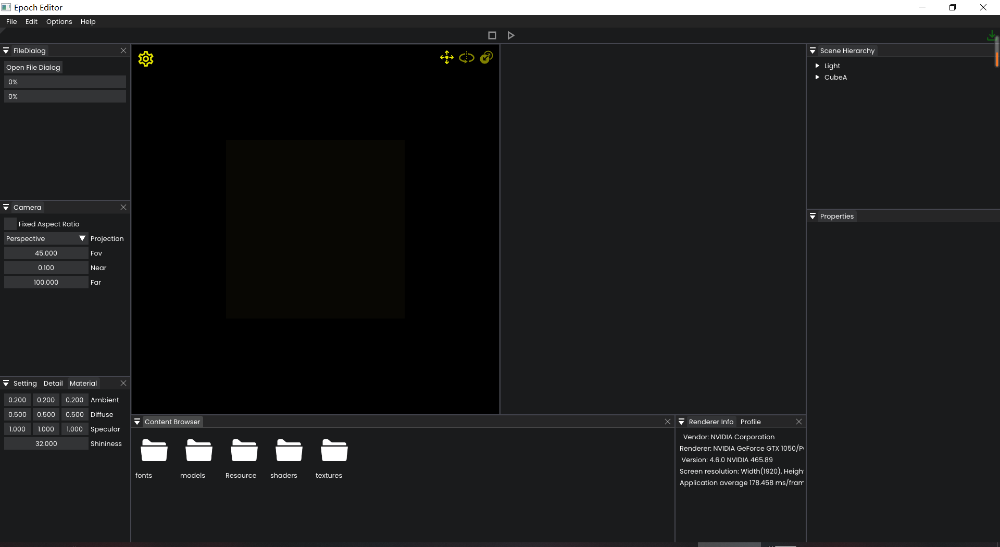
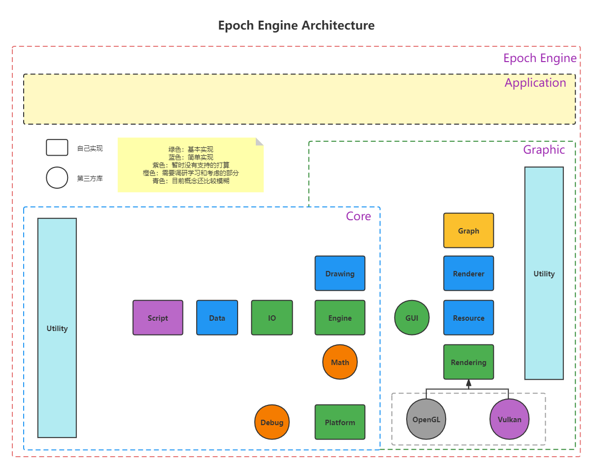

# Epoch文档

## 快速开始
因为Epoch目前仍处于快速开发阶段，并未发布任何正式或测试版本。所以目前仅可以通过Clone或下载代码仓库构建构成进行体验。

### 1.获取代码与构建

- 递归克隆仓库： `git clone --recursive https://github.com/Acmen-Team/Epoch`
- 更新子模块： `git submodule update --init`
    + 这一步可能会存在因为网络问题无法成功拉取更新子模块，解决办法为手动下载相关子模块并拷贝到指定目录下，或开启魔法上网。

*目前支持VS2017和VS2019的脚本化构建（在仓库的Script文件夹里）*

### 2.现有功能介绍
对于Epoch目前具有的能力主要从两个角度去介绍，分别为**编辑器界面层**与**代码层**。
#### 编辑器层

- 菜单栏
- 工具栏
- 渲染窗口
    + 实时窗口
    + 离线窗口
- 目录窗口
- 场景树窗口
- 属性窗口
- 临时功能窗口
    + FileDialog
    + Camera
    + Setting
    + Profiler

#### 代码层

### 3.基本操作介绍
摄像机移动
- W/w
- S/s
- A/a
- D/d
- E/e
- Q/q

切换transform属性
- 空格键（目前存在的问题即使没有选择任何物体也可点击进行UI上的响应）

## 引擎架构

### 平台层

### 核心层

### 渲染层

### 功能层

## 相关链接

